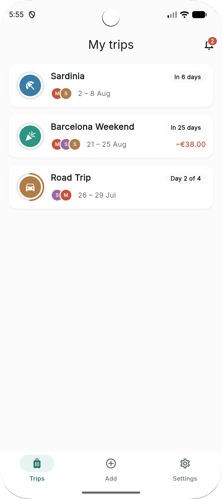
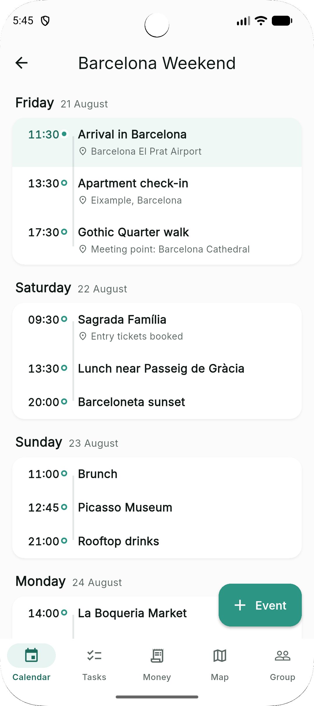
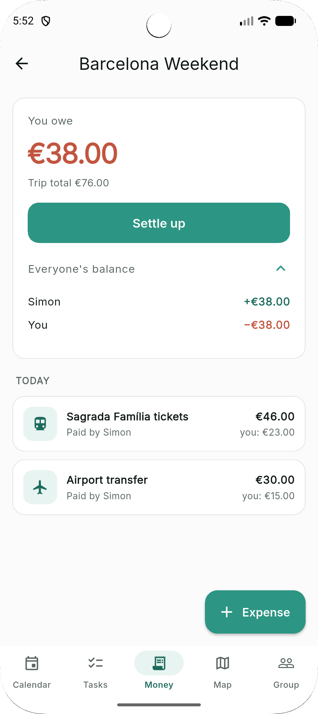
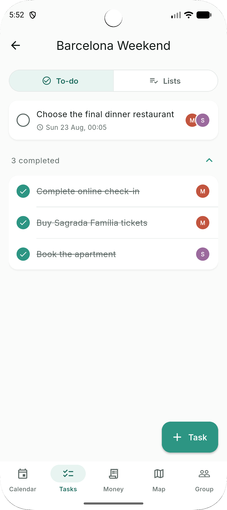
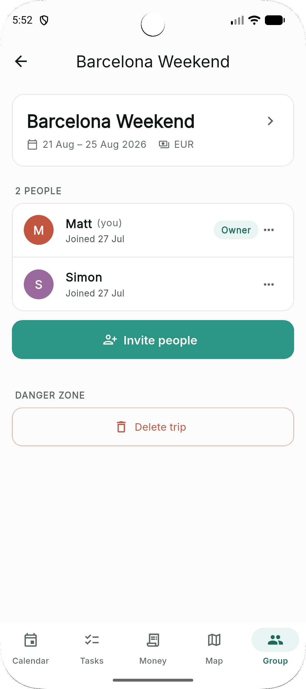
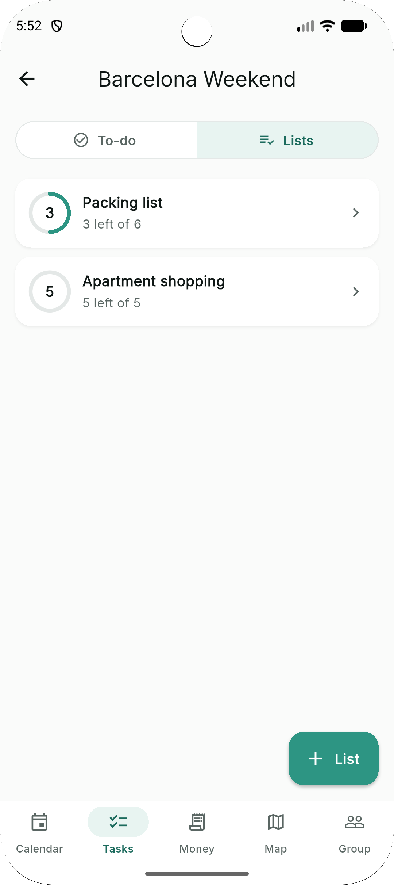
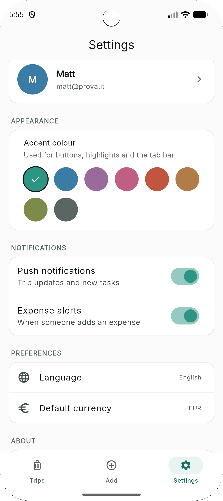
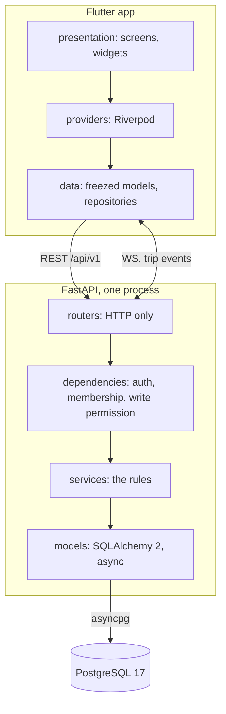

<p align="center">
  
</p>

<p align="center">
  
</p>

<p align="center">
  <em>Everything a group of friends has to agree on before, during and after a trip.</em>
</p>

<p align="center">
  
  
  
  
</p>

<p align="center">
  
  
  
  
</p>

<details>
<summary align="center">More screens</summary>
<p align="center">
  
  
  
  
</p>
</details>

---

## What it is

Five people go away for a weekend. One books the hostel, another pays for
dinner, a third is still asking where everyone is at four in the afternoon, and
by Monday nobody can reconstruct who owes what. TodoTrip is the one place all of
that lives.

A **trip** is the boundary of everything: the plan, the money, the map, the
people. You join one with a code, and from that moment you see everything inside
it and nothing outside it.

|                   |                                                                                                                  |
| ----------------- | ---------------------------------------------------------------------------------------------------------------- |
| **Calendar**      | The itinerary, grouped by day. The next thing about to happen is the only row on screen that asks for attention.  |
| **To-do & lists** | Tasks with a deadline and an owner, plus throwaway checklists for the twenty things to grab in a supermarket.     |
| **Money**         | Shared expenses with uneven splits, running balances, and the shortest set of payments that settles the group.    |
| **Map**           | Places the group saved, and where everyone is right now, for as long as they choose to share it.                  |
| **Group**         | Who is here, invite codes, and the rules for leaving without wrecking the accounts.                               |

Also: in-app notifications, five languages, eight selectable accent colours, and
a CSV export for anybody who trusts a spreadsheet more than an app.

---

## How it is built



**Layers are one way.** A router never touches a model; it turns HTTP into a
service call, and a service error into a status code. A service never imports
FastAPI. That is what makes the rules testable without a request.

The full picture, including the data model, the authorization ladder and the
anatomy of a single write, is in
**[docs/ARCHITECTURE.md](docs/ARCHITECTURE.md)**.

### Seven decisions worth knowing

**Membership is the only authorization.** A row in `trip_members` is what grants
access to everything inside a trip, checked by one dependency that every
trip-scoped endpoint declares. A stranger asking for a trip gets **404, not
403**, because a 403 would confirm the trip exists.

**Money is integer cents, and balances are never stored.** Floating point cannot
represent `0.01`, and the error becomes visible after a handful of splits.
Balances are recomputed from expenses, shares and repayments every time they are
asked for. A stored total is a second source of truth that eventually disagrees
with the first.

**Some records outlive the people in them.** Leaving a trip is blocked while you
owe money, because your shares cannot be deleted without silently changing what
everyone else owes. A closed account is emptied rather than deleted, for the
same reason, and remembered in `trip_past_members` so old expenses still have a
name on them.

**Realtime is a bell, not a channel.** A websocket event carries the fact that
something changed and never the data itself; clients re-run a GET they already
know. No merging, no conflicts, no client drifting from the server. Every screen
also refetches on tab change and on resume, so with the socket down the app
behaves exactly as it did before realtime existed.

**Notifications are the opposite, so they get a table.** Missing an event is
harmless; missing a notification means it never happened. Rows are written one
per recipient, with the facts frozen at that moment, because an expense deleted
next week must not turn its notification into "somebody did something".

**Pagination is keyset, and only where a list can really grow.** Expenses and
notifications are cut into pages with a cursor over `(timestamp, id)` rather
than an offset: a row inserted mid-scroll shifts an offset, so page two opens
with a row already read. Everything else arrives whole, because a fortnight's
plan is tens of entries while the same fortnight is hundreds of expenses.
Balances keep their own query on purpose. A balance over the thirty most recent
expenses is not a smaller balance, it is a wrong one.

**Archiving is enforced by the server.** An archived trip refuses every write
across seventeen endpoints, not only the ones whose button is hidden. A rule
that lives in the UI is not a rule: an older client, a retried request or a
terminal walks straight past it.

### Realtime runs on one worker

The fan-out in `app/core/events.py` is in-memory and single-process **on
purpose**. With several uvicorn workers, an event raised on worker 1 never
reaches a socket held by worker 3, and realtime that works intermittently looks
like a client bug and is not. Run production with one worker. When the API needs
to scale, replace the in-process fan-out inside `emit()` with Redis pub/sub. The
twenty-odd routers that call `emit()` do not change.

---

## Run it

```bash
docker compose up
```

That builds the API, waits for PostgreSQL to actually accept queries, applies
the migrations, creates the test database, and serves on
**http://localhost:8000**, with interactive docs at **/docs**. Source is mounted
live, so saving a file reloads the server.

The app is the one thing Docker cannot start for you, because it needs a device:

```bash
cd mobile && flutter run
```

The Android emulator reaches the host API through `10.0.2.2` on its own, so
nothing is needed there.

<details>
<summary>Running the app on a physical phone</summary>

A physical phone does need telling, because `localhost` on a phone means the
phone. Find your machine's address on the local network (`ipconfig` on Windows,
`ip addr` or `ifconfig` elsewhere) and pass it in:

```bash
flutter run --dart-define=API_BASE_URL=http://YOUR-MACHINE-IP:8000/api/v1
```

Both devices have to be on the same wifi, and on Windows the first attempt
usually fails until the firewall is allowed to accept connections on port 8000.

</details>

<details>
<summary>Without Docker</summary>

```bash
docker compose up -d db
cd backend
python -m venv .venv && .venv/Scripts/pip install -r requirements.txt
alembic upgrade head
uvicorn app.main:app --reload
```

</details>

### Tests

```bash
cd backend && pytest
```

```bash
cd mobile && flutter test
```

The backend suite needs the `todotrip_test` database, which `docker compose up`
creates. One caveat worth knowing: it drops and recreates its schema on startup,
so two runs at once destroy each other. Give each a separate `TEST_DATABASE_URL`
if you ever want them in parallel.

### Regenerating the app icon

```bash
python tools/brand/generate_icons.py
```

The icon is the T of the wordmark, lifted from `docs/brand/wordmark.png` rather
than drawn separately, so the launcher icon and the logo cannot drift apart. The
script writes every Android density, both adaptive-icon layers, the whole iOS
set, and the copy this README shows at the top.

---

## Layout

```
backend/
  app/
    core/         security, websockets, rate limiting, pagination, logging
    models/       one table per file
    schemas/      the API contract, Pydantic v2
    services/     the rules
    routers/      HTTP, 59 endpoints
  alembic/        11 migrations, applied automatically at startup
  tests/          17 files, one per feature
mobile/
  lib/
    core/         theme, money, currency, localisation, router, network
    features/     auth, trips, notifications, onboarding, settings, shell
    l10n/         ARB files in five languages, English is the template
  test/           19 files
  assets/legal/   the privacy policy, shipped as a file and read by the app
tools/brand/      the icon generator
```

Every feature folder is `data/` (models and repositories) plus `presentation/`
(screens and widgets), with a `providers.dart` between them.

On the server the trip rules are split by what they are about rather than by
size: `trip_service` for the trip itself, `member_service` for joining, leaving
and handing ownership on, `invite_service` for codes, and `trip_errors` for the
vocabulary all three raise and every router catches.

---

## Conventions

- **Comments explain why, never what.** A line that needs saying what it does
  gets rewritten instead.
- **The server sends codes, not sentences.** A 409 carries
  `{"code": "outstanding_balance", ...}`, and the app decides the wording in the
  reader's language. Nothing user-facing is ever stored in English.
- **Colour is never the only signal.** Money owed is red *and* signed *and*
  labelled, because roughly 8% of men would otherwise read nothing at all.
- **Contrast is measured, not eyeballed.** Every accent colour is asserted
  against WCAG thresholds in the test suite, so a pretty new swatch that fails
  cannot ship.
- **A currency is a real currency.** Trip currencies are checked against ISO
  4217 on the way in, and every amount is formatted with its own symbol. Both
  used to be a three-character length check and a hardcoded euro sign.
- **Every request is one log line, with an id.** Returned in `X-Request-ID`, so
  a failure somebody reports can be found rather than guessed at.

---

## Status

Working end to end and used on real trips. The known limits are deliberate, and
each one is documented where it lives: a single API worker, OpenStreetMap's
public tile servers, and translations not yet reviewed by native speakers.

There is no hosted instance and no build on any store. The privacy policy is
written accordingly. It describes what the code does with data, and doubles as
the template anybody deploying it would have to complete before running it for
other people. Accepting it is required to create an account, and the server
records when and against which version, because a tick box the sign-up screen
checks is a tick box rather than a record.

---

## Licence

Copyright © 2026 Simone Acierno.

Released under the **Apache License 2.0**. The full text is in
[LICENSE](LICENSE).

In short: use it, study it, change it, share it, including in commercial
projects. If you distribute a modified version you have to keep the original
copyright notice and licence text, state what you changed, and not use my name
to endorse your product. Contributors also grant you a patent licence on their
contributions, so nobody can hand you code and then sue you for using it.
