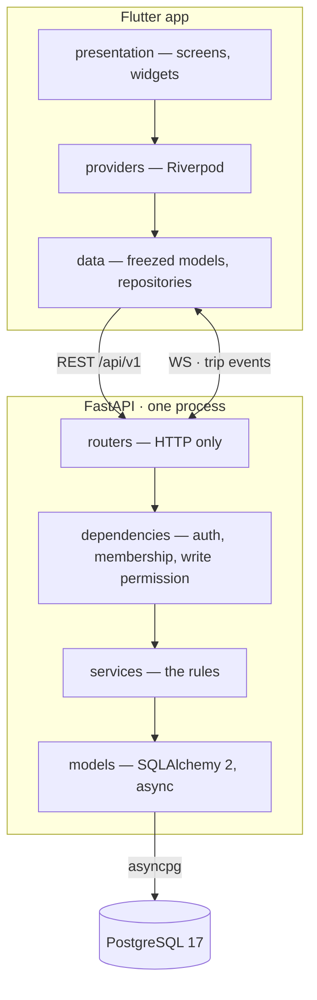

<p align="center">
  
</p>
<p align="center">
  <em>Everything a group of friends has to agree on before, during and after a trip.</em>
</p>
<p align="center">
  
  
  
  
</p>

---

## What it is

Five people go away for a weekend. One books the hostel, another pays for
dinner, a third is still asking where everyone is at four in the afternoon, and
by Monday nobody can reconstruct who owes what. TodoTrip is the one place all of
that lives.

A **trip** is the boundary of everything: the plan, the money, the map, the
people. You join one with a code, and from that moment you see everything in it
and nothing outside it.

| | |
|---|---|
| **Calendar** | The itinerary, grouped by day. The next thing about to happen is the only row on screen that asks for attention. |
| **To-do & lists** | Tasks with a deadline and an owner, and throwaway checklists for the twenty things to grab in a supermarket. |
| **Money** | Shared expenses with uneven splits, running balances, and the shortest set of payments that settles the group. |
| **Map** | Places the group saved, and where everyone is right now — while they choose to share it. |
| **Group** | Who is here, invite codes, and the rules for leaving without wrecking the accounts. |

Plus: in-app notifications, five languages, eight selectable accent colours, and
a CSV export for anybody who trusts a spreadsheet more than an app.

---

## Run everything with one command

```bash
docker compose up
```

That builds the API, waits for PostgreSQL to actually accept queries, applies
the migrations, creates the test database, and serves on
**http://localhost:8000** — interactive docs at **/docs**. Source is mounted
live, so saving a file reloads the server.

The app is the one thing Docker cannot start for you, because it needs a device:

```bash
cd mobile && flutter run
```

The Android emulator reaches the host API through `10.0.2.2` on its own, so
nothing is needed there.

A physical phone does need telling, because `localhost` on a phone means the
phone. Find your machine's address on the local network — `ipconfig` on Windows,
`ip addr` or `ifconfig` elsewhere — and pass it in:

```bash
flutter run --dart-define=API_BASE_URL=http://YOUR-MACHINE-IP:8000/api/v1
```

Both devices have to be on the same wifi, and on Windows the first attempt
usually fails until the firewall is allowed to accept connections on port 8000.

### Without Docker

```bash
docker compose up -d db
cd backend
python -m venv .venv && .venv/Scripts/pip install -r requirements.txt
alembic upgrade head
uvicorn app.main:app --reload
```

### Tests

```bash
cd backend && pytest          # needs the todotrip_test database, created above
cd mobile && flutter test
```

---

## How it is built



**Layers are one-way.** A router never touches a model; it translates HTTP into
a service call and a service error into a status code. A service never imports
FastAPI. That is what makes the rules testable without a request.

The full picture — data model, authorization ladder, the anatomy of a write —
is in **[docs/ARCHITECTURE.md](docs/ARCHITECTURE.md)**.

### Six decisions worth knowing

**Membership is the only authorization.** A row in `trip_members` is what grants
access to everything inside a trip, checked by a single dependency that every
trip-scoped endpoint declares. A stranger asking for a trip gets **404, not
403** — a 403 would confirm the trip exists.

**Money is integer cents, and balances are never stored.** Floating point cannot
represent `0.01`, and the error is visible after a handful of splits. Balances
are recomputed from expenses, shares and repayments every time they are asked
for: a stored total is a second source of truth that eventually disagrees with
the first.

**Some records outlive the people in them.** Leaving a trip is blocked while you
owe money, because your shares cannot be deleted without silently changing what
everyone else owes. A closed account is emptied rather than deleted, for the
same reason, and remembered in `trip_past_members` so old expenses still have a
name on them.

**Realtime is a bell, not a channel.** A websocket event carries the fact that
something changed and never the data; clients re-run the GET they already know.
No merging, no conflicts, no client drifting from the server. Every screen also
refetches on tab change and on resume, so with the socket down the app behaves
exactly as it did before realtime existed.

**Notifications are the opposite, so they get a table.** Missing an event is
harmless; missing a notification means it never happened. Rows are written one
per recipient with the facts frozen at that moment — an expense deleted next
week must not turn its notification into "somebody did something".

**Archiving is enforced by the server.** An archived trip refuses every write
across seventeen endpoints, not just the ones with a hidden button. A rule that
lives in the UI is not a rule: an older client, a retried request or a terminal
would walk straight past it.

### Realtime runs on one worker

The fan-out in `app/core/events.py` is in-memory and single-process **on
purpose**. With several uvicorn workers, an event raised on worker 1 never
reaches a socket held by worker 3, and realtime that works intermittently looks
like a client bug and is not. Run production with one worker. When the API needs
to scale, replace the in-process fan-out inside `emit()` with Redis pub/sub —
the twenty-odd routers calling `emit()` do not change.

---

## Layout

```
backend/
  app/
    core/         security, websockets, rate limiting, invite codes
    models/       one table per file
    schemas/      the API contract, Pydantic v2
    services/     the rules
    routers/      HTTP
  alembic/        migrations, applied automatically at startup
  tests/          307 tests, one file per feature
mobile/
  lib/
    core/         theme, money, localisation, router, network
    features/     auth · trips · notifications · settings · shell
    l10n/         ARB files, English is the template
  test/           123 tests
  assets/legal/   the privacy policy, shipped as a file and read by the app
```

Every feature folder is `data/` (models and repositories) plus `presentation/`
(screens and widgets), with a `providers.dart` between them.

---

## Conventions

- **Comments explain why, never what.** If a line needs saying what it does, it
  gets rewritten instead.
- **The server sends codes, not sentences.** A 409 carries
  `{"code": "outstanding_balance", ...}`; the app decides the wording, in the
  reader's language. Nothing user-facing is ever stored in English.
- **Colour is never the only signal.** Money owed is red *and* signed *and*
  labelled; roughly 8% of men would otherwise read nothing at all.
- **Contrast is measured, not eyeballed.** Every accent colour is asserted
  against WCAG thresholds in the test suite, so a pretty new swatch that fails
  cannot ship.

---

## Status

Working end to end and used on real trips. Known limits, all deliberate and all
documented where they live: one API worker, OpenStreetMap's public tile servers,
translations not yet reviewed by native speakers, and a privacy policy that
still needs its controller details filled in before it means anything legally.

---

## Licence
Copyright © 2026 Simone Acierno.

Released under the **Apache License 2.0** — the full text is
in [LICENSE](LICENSE).
