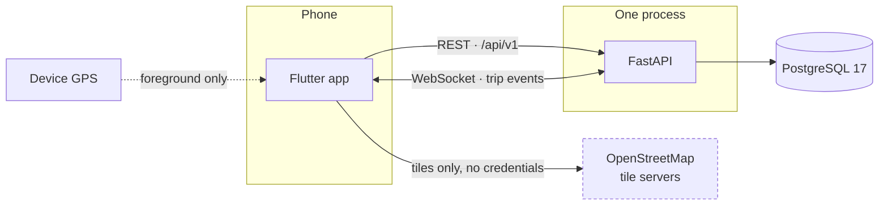
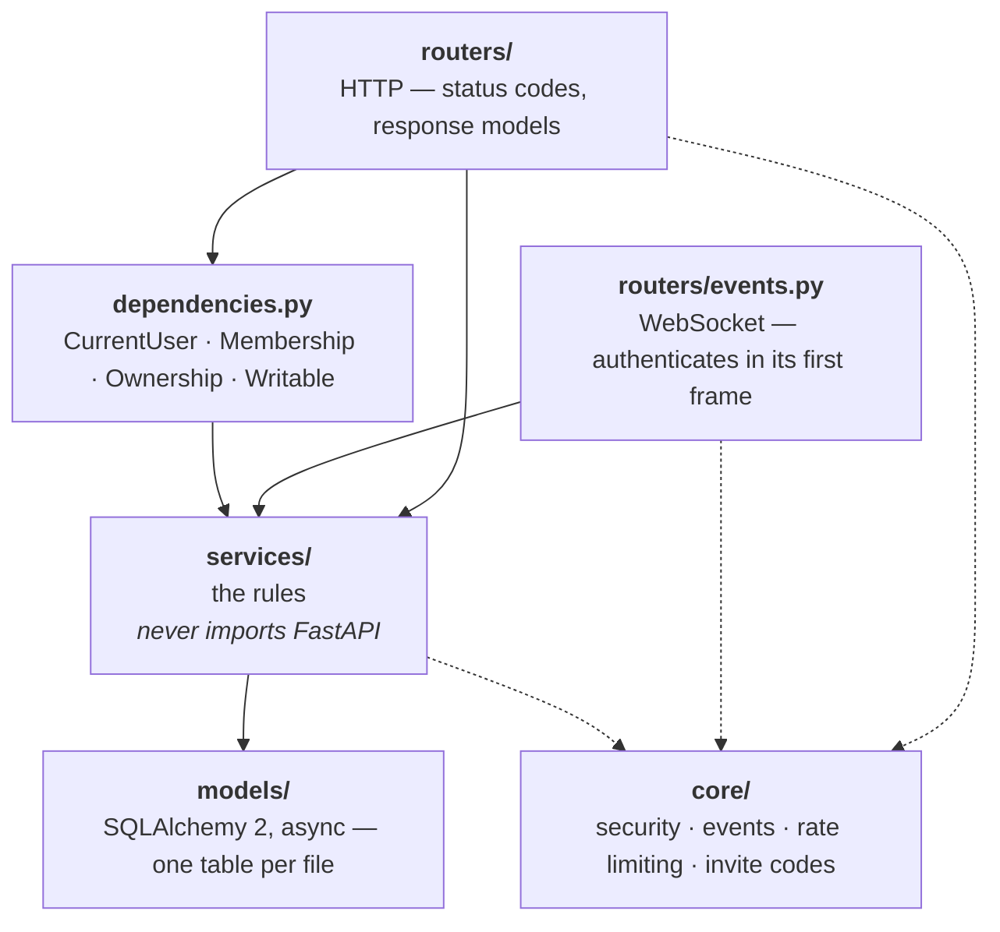
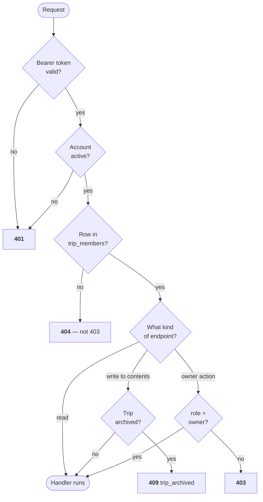
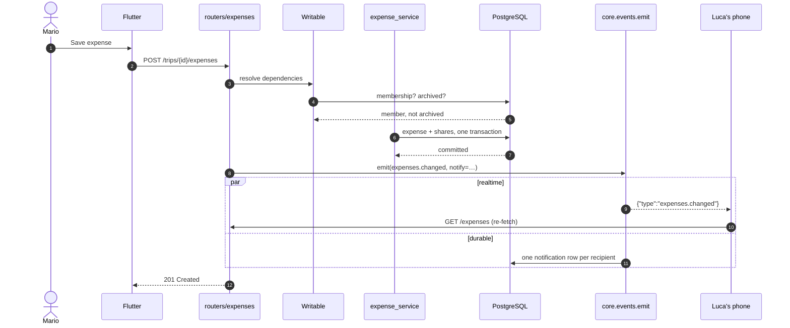
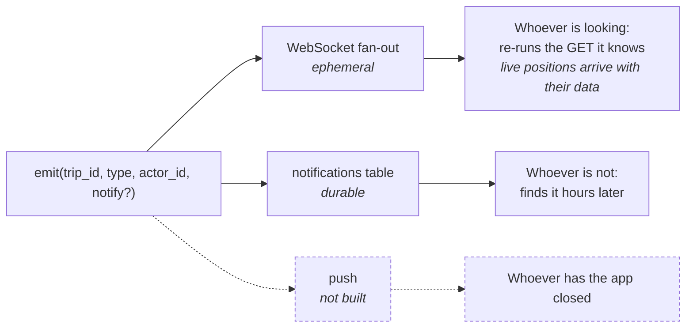
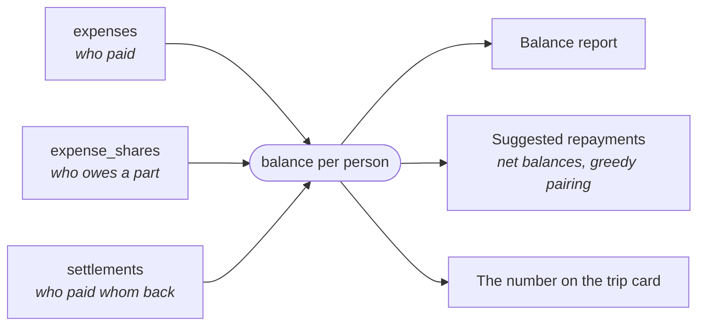
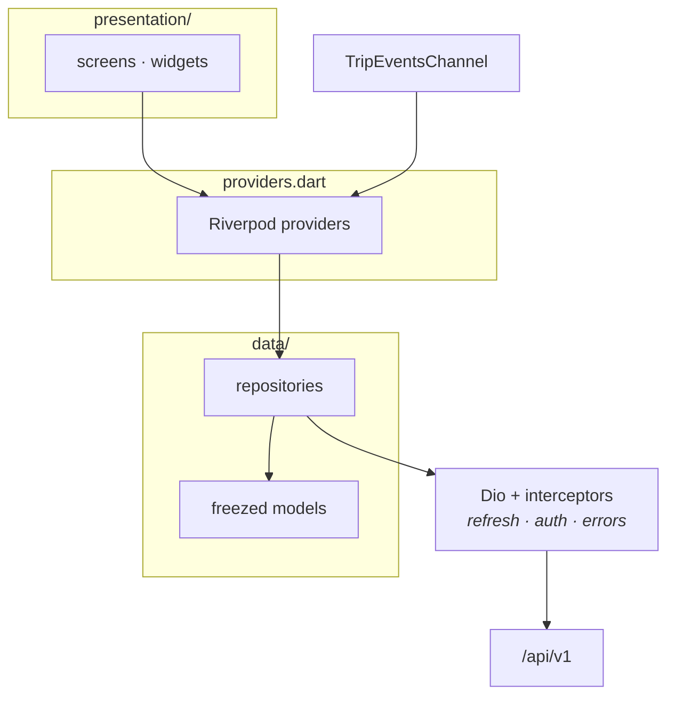
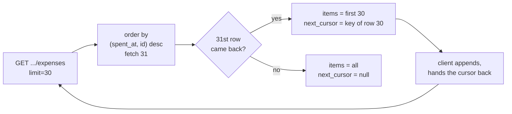

# Architecture

How TodoTrip is put together, and why it is put together that way. The diagrams
render on GitHub; nothing here needs regenerating when the code changes, only
correcting.

- [The system](#the-system)
- [Backend layers](#backend-layers)
- [Authorization](#authorization)
- [Data model](#data-model)
- [Anatomy of a write](#anatomy-of-a-write)
- [The three channels of `emit()`](#the-three-channels-of-emit)
- [Money](#money)
- [Client](#client)
- [What we deliberately did not build](#what-we-deliberately-did-not-build)

---

## The system

Two things are worth reading off this picture.

**The map talks to OpenStreetMap directly, on its own connection.** A separate
Dio client with no interceptors, so the session token cannot travel to a third
party by accident. OSM sees an IP and a tile coordinate, never an account.

**There is exactly one API process.** Not a simplification of the diagram — a
constraint, explained under [`emit()`](#the-three-channels-of-emit).

---

## Backend layers

Services do not import FastAPI. Database reads and domain operations live there;
routers translate requests, returned objects and domain errors into HTTP or
WebSocket messages. Model attributes and domain enums are still used by routers.
Routers still select notification kinds and recipients, including the threshold
for notifying expense deletion; the layer boundary does not imply all policy
is absent from handlers. Notification snapshot construction lives in `notification_service.money_payload`;
user lookup lives in `auth_service.get_user`, shared by HTTP authentication and
the WebSocket handshake/watchdog. The WebSocket router owns the short-lived
sessions and closes them, but does not query models directly. The infrastructure
health probe in `app/main.py` is an explicit exception: it runs `SELECT 1`.

The layer that earns its keep most is `dependencies.py`. It is four declarations
that every trip-scoped endpoint reuses, and it is the reason there is exactly
one implementation of "may this person do this".

---

## Authorization

Every request into a trip walks the same ladder. Each rung is a dependency, so
an endpoint opts in by naming a type.

**Why 404 and not 403 for a stranger.** A 403 answers the question that was
actually being asked: *does this trip exist?* Anybody could then walk the id
space and learn which trips are real. A 404 tells them nothing they did not
bring with them.

**Why `Writable` exists at all.** Archiving means "nothing more goes in here".
Hiding buttons in the app does not achieve that — an older client, a request
retried from a queue, or anybody with a terminal walks straight past it. The
`Writable` dependency protects 18 content operations: 4 for expenses/repayments,
5 for plan items, 6 for checklists/entries and 3 for pins. It does not guard trip
metadata, archive/unarchive/delete, membership or invite management, personal
notification settings, or live-location updates/clears. Those operations retain
their normal authorization checks. Reads and CSV export remain available.

---

## Data model

```mermaid
erDiagram
    USERS ||--o{ TRIP_MEMBERS : "joins"
    USERS ||--o{ REFRESH_TOKENS : "signs in with"
    USERS ||--o{ NOTIFICATIONS : "is told"
    TRIPS ||--o{ TRIP_MEMBERS : "has"
    TRIPS ||--o{ TRIP_PAST_MEMBERS : "remembers"
    TRIPS ||--o{ INVITES : "is entered by"
    TRIPS ||--o{ ITEMS : "plans"
    TRIPS ||--o{ CHECKLISTS : "collects"
    TRIPS ||--o{ EXPENSES : "spends"
    TRIPS ||--o{ SETTLEMENTS : "settles"
    TRIPS ||--o{ MAP_PINS : "saves"
    TRIPS ||--o{ MEMBER_LOCATIONS : "shows"
    ITEMS ||--o{ ITEM_ASSIGNEES : "is given to"
    CHECKLISTS ||--o{ CHECKLIST_ENTRIES : "holds"
    EXPENSES ||--o{ EXPENSE_SHARES : "splits into"

    TRIP_MEMBERS {
        uuid trip_id FK
        uuid user_id FK
        enum role "owner or member"
        bool muted "per person, never per trip"
    }
    TRIPS {
        date start_date "null until agreed"
        string base_currency "no exchange rate anywhere"
        timestamp archived_at "null while live"
    }
    ITEMS {
        enum type "event or task"
        timestamp completed_at "answers done? and when?"
    }
    EXPENSES {
        bigint amount_cents "integer, never float"
        uuid paid_by FK
    }
    EXPENSE_SHARES {
        bigint share_cents "sums to the parent amount"
    }
    SETTLEMENTS {
        uuid from_user_id FK
        uuid to_user_id FK
        bigint amount_cents "direction is from/to, never a sign"
    }
    MEMBER_LOCATIONS {
        float latitude
        timestamp expires_at "30 minutes, then invisible"
    }
    NOTIFICATIONS {
        uuid user_id FK "one row per recipient"
        jsonb payload "facts frozen at write time"
        timestamp read_at "personal state"
    }
```

Six choices in that schema are load-bearing.

**`trip_members` is the authorization.** Presence of a row *is* permission. That
is why leaving is a delete and why `trip_past_members` is a separate table
instead of a `left_at` column: one forgotten filter on a nullable flag would be
a former member reading the group's ledger.

**Exactly one owner, and the database says so.** A partial unique index over
`trip_id where role = 'OWNER'` makes a second owner impossible to write. The
service transfers ownership as a compare-and-swap — an UPDATE that only matches
while the caller is still the owner — because reading the role and then writing
both rows looks atomic inside one transaction and is not: two transfers starting
together would each demote the same person and promote a different one, leaving
a trip with two owners and no way to tell which was wrong.

**Timestamps instead of booleans.** `completed_at`, `checked_at`, `archived_at`,
`read_at`, `revoked_at` each answer *whether* and *when* in one column, and a
boolean beside a date would be two sources of truth for one fact.

**Integer cents, and no exchange rate.** Binary floating point cannot represent
`0.01`; the error shows after a handful of splits. There is nowhere to put a
rate, which is exactly why changing a trip's currency is a rename and the
settings screen says so in a sentence rather than an asterisk.

**Direction is `from`/`to`, never the sign of an amount.** Two check constraints
enforce it: amounts are positive and nobody settles with themselves.

**`member_locations` cannot become a trail.** One row per person per trip,
overwritten in place, expiring after thirty minutes. It is shaped so it cannot
accidentally turn into a history that nobody consented to.

---

## Anatomy of a write

Adding an expense, end to end.

Note step order: `emit()` runs **after** the commit, never inside the
transaction. Announcing a change that then rolls back sends every client
fetching data that does not exist.

---

## The three channels of `emit()`

One call, because it is one moment — *X happened in trip Y, caused by Z*.

**Why the two channels are not one.** Losing a websocket event is harmless: the
next fetch shows current data regardless. Losing a notification means it never
happened. One is a bell, the other is a record — so one is memory and the other
is a table.

**The deliberate payload exception.** Events about durable trip content announce
a change for the client to refetch. Live location, though temporarily stored,
travels directly: a position is a couple of numbers, it is
ephemeral, and each member sends one at most every twenty seconds, so telling
every other member to refetch it would be dozens of requests a minute to move a
few bytes. `location.update` carries the coordinates and `location.cleared` the
member it concerns; the app applies them directly.

**Why they are raised from the same call.** The alternative is writing
notifications in the routers, and then adding push means a second full pass over
the same twenty endpoints.

**The single-worker constraint.** The fan-out holds sockets in process memory.
With several uvicorn workers an event raised on worker 1 never reaches a socket
held by worker 3, and realtime that works intermittently reads as a client bug.
Run one worker. To scale, replace the inside of `emit()` with Redis pub/sub —
the callers do not change, which is the point of the facade.

---

## Money

Balances are **never stored**. They are recomputed from three kinds of row every
time anybody asks.

`simplify_debts()` sorts debtors and creditors once by descending amount, with
UUIDs breaking ties, then pairs them while carrying remainders forward. It
clears zero-sum balances with at most n-1 transfers for n nonzero participants
(and no transfers for an already settled group). It does **not** guarantee the
globally minimum number of payments.

For example, debts of 800, 700 and 500 cents against credits of 1200 and 800
produce four payments: 800 to the first creditor, then 400 and 300 from the
second debtor, then 500 from the third. Three payments would suffice by matching
800 to 800 and paying 700 plus 500 to the 1200 creditor. The app promises useful
repayment suggestions through balance netting, not an optimal transfer count.
The arithmetic and deterministic greedy algorithm are intentionally unchanged.

Leaving a trip requires a zero balance, whether the member owes or is owed.
Closing an account instead retains the user ID and accounting references while
clearing the profile name, replacing the email and disabling credentials. It
removes memberships and live locations and revokes refresh tokens. Frozen
notification payloads are not rewritten on closure, so actor names can remain
until notification deletion or retention cleanup; free-text content is also
retained. Keeping accounting references is not a claim of complete anonymisation.

A stored total is a second source of truth that eventually disagrees with the
first, and by then nobody knows which one is wrong. Recomputing costs two
queries.

The trip list uses the same arithmetic restricted to one person, batched across
every trip at once: **four queries for the whole screen**, regardless of how many
trips there are. A test asserts that the number on a card equals the number in
that trip's balance report — the list and the money tab are not allowed to
disagree.

---

## Client

One feature folder per area — `auth`, `trips`, `notifications`, `settings`,
`shell` — each with `data/`, `presentation/` and a `providers.dart` between them.

Three rules that shaped it:

**The server sends codes, the app writes the sentences.** A 409 carries
`{"code": "outstanding_balance", "balance_cents": 2050}`. Nothing user-facing is
stored or transmitted in English, which is what lets five languages exist without
a history stuck in whichever one was active when the row was written.

**Realtime is an optimisation, never a requirement.** Every screen refetches on
tab change and on resume. With the socket down the app behaves exactly as it did
before realtime existed.

**Optimistic where waiting would feel broken, honest everywhere else.** A ticked
checkbox and a cleared notification badge flip locally first and reconcile after;
anything touching money waits for the server.

---

## Pagination

Two lists in the app grow without a ceiling: a user's **notifications** and a
trip's **expenses**. Everything else is bounded by what a group is willing to
type. Both of the unbounded ones are cut into pages by the same helper, and the
rest are fetched whole on purpose.

**Keyset, not offset.** `OFFSET 30` counts rows from the top, so an expense
added while somebody is reading pushes everything down by one and page two opens
with a row they have already seen. On a list sorted newest-first that insertion
is the normal case, not an edge case. The cursor instead names the last row read
— `(spent_at, id)` — and the next page is everything strictly older than it,
which no concurrent write can disturb.

The **id is part of the key** and not decoration. Rows written by one request
share a timestamp to the microsecond; a boundary landing inside such a group
would drop or repeat its members depending on which way the tie broke.

The cursor is **opaque** — base64 over the two values — so how pages are cut can
change without a client release.

### What the page carries

`{ items, next_cursor, total }`. The total is a second query, and it earns its
keep: the money tab tells you how many expenses a trip has, and a screen that
counts what it has loaded shows a number that grows as you scroll. A count over
an indexed column is cheap. A figure that is quietly wrong is not.

### What is deliberately not paginated

| List | Why it arrives whole |
|---|---|
| Balances | A balance over the thirty most recent expenses is not a smaller balance, it is a **wrong** one. `get_balance_report` calls `_all_expenses`, which exists separately from the paginated listing precisely so a page size can never be mistaken for a complete set. |
| Settlements | One per debt actually repaid — bounded by how many people owe each other. They also share the money tab's single chronological column with the expenses, and two independent cursors cannot be interleaved: page two of one merged with page one of the other puts older rows above newer. |
| Items, checklists, map pins | Bounded by human patience. A fortnight's plan is tens of entries; the same fortnight is hundreds of expenses. `/items` already narrows server-side by type, assignee, completion and date range, which is the pressure that would otherwise become pagination. |
| CSV export | The point of the export is that it is complete. |

The client mirrors the split: `ExpenseList` is an `AsyncNotifier` that appends
pages and keeps the server's `total`, and a sentinel widget below the last row
asks for the next page the moment it is built — which, at the bottom of a lazy
scroll view, is the moment it scrolls into view. No scroll listener, no pixel
threshold to tune.

## What we deliberately did not build

| Not built | Why |
|---|---|
| Redis / multiple workers | One process serves this fine. The facade is in place for the day it does not. |
| Push notifications | The in-app feed and the connection manager are the hard half; the rest is platform plumbing. |
| Photo uploads for trips | Storage, a CDN, resizing and camera permissions, for something nobody would tell apart from a coloured icon at this size. |
| Changing your email | It has to prove the new address belongs to you, or it becomes account takeover by typo. No mail sender exists yet. |
| Currency conversion | A rate has to come from somewhere and be pinned to a date. Until then the app says plainly that changing currency renames, not converts. |
| A dark theme | Twenty screens with hardcoded ink and background colours. Doing it half-way is worse than not doing it. |
